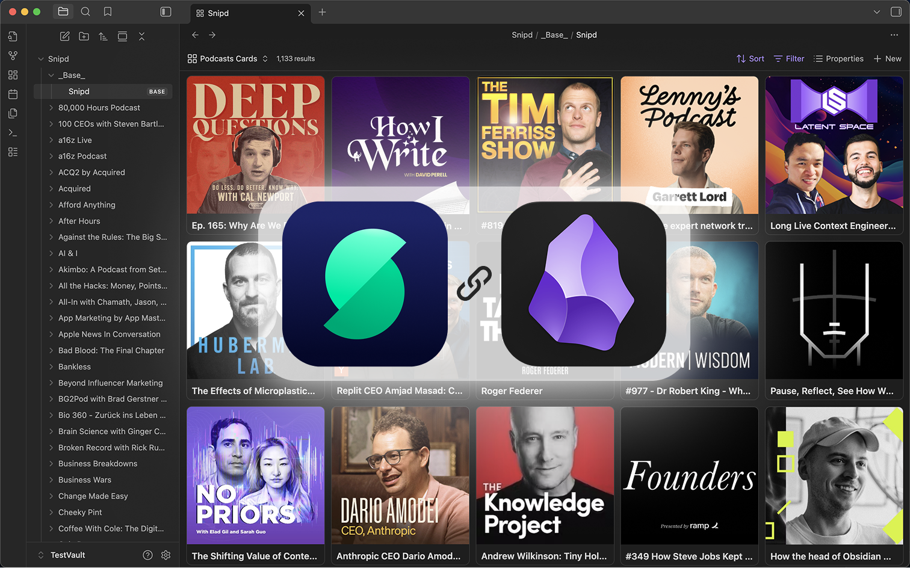
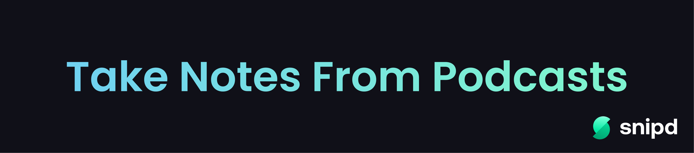

# Snipd Official 🎙️

The official [Snipd](https://www.snipd.com) plugin maintained by the Snipd team.  

Lets you automatically sync all your podcast highlights (=snips) to your Obsidian Vault, including transcript, notes, ai summary and more.

## Plugin Features

- Automatically sync your snips to your Obsidian vault, including:
  - Transcript
  - AI-summary
  - Your notes
  - Link to snip
  - Rich podcast metadata incl. image, title, publish date & more
- Customize the formatting
- Choose whether to only sync edited snips
- Compatible with Obsidian Bases:
  - Metadata as properties
  - Two default Bases views out of the box

## About Snipd
[Snipd](https://www.snipd.com) is an AI-powered podcast app that let's you highlight and take notes from podcasts just by tapping your headphones.  

You can also chat with episodes, see all mentioned books, or generate summaries.  
You can download it [here](https://www.snipd.com).

## Plugin Demo

## Plugin Setup

1. Install & enable the plugin inside Obsidian's community plugin section
2. Open the plugin settings
3. Click on "Connect" and sign in with your Snipd account
4. Optionally click "Test sync" to test the connection and output format
5. Optionally customize your template
6. Click "Start syncing" to start your first sync

## Custom Formatting

Inside the plugin's settings, go to "Custom formatting" and click "Configure":
- **Episode filename template**: Customize how episode files are named
- **Episode template**: Control how episode files are formatted
- **Snip template**: Control how individual snips appear

## Support & Feedback

If you encounter any issues, have questions or want to pass along feature requests, please contact us via the in-app feedback button inside the Snipd mobile app.  
You can find it in "You" -> Settings -> Feedback.

**Note:** This plugin requires a Snipd account to access the API. You can create a free account inside the mobile app.  
[Get the Snipd app](https://www.snipd.com)

## We hope you like it! :)
